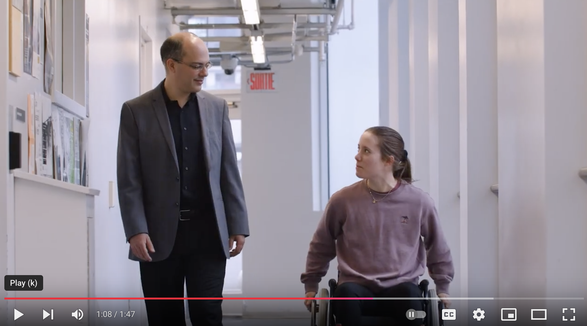

# Welcome

|                               ❗️We are currently looking for MSc and PhD students ❗️                               |
| :----------------------------------------------------------------------------------------------------------------: |
| [Master’s students in Engineering : Software, Information Technology or equivalent](files/Labbé-Chénier-VR-EN.pdf) |
|                      [PhD student in engineering](files/Aissaoui-Chénier-ModélisationEN.pdf)                       |

----------------

The Mobility and Adaptive Sports Research Lab's mission is to increase fundamental knowledge 
on the biomechanical interactions between the person, his technical aid and his environment in a context of mobility and practice of adapted sports.

Such new knowledge, acquired through the development and use of new technologies, is essential to better understand the mechanisms of injury development and the effect of adaptations (eg, positioning, sizing, specific training) on performance, risk of injury, and benefits of adapted physical activity in a functional rehabilitation setting.

- [Étudier au laboratoire](/studying)
- [Université du Québec à Montréal (UQAM)](https://uqam.ca)
- [Centre de recherche interdisciplinaire en réadaptation du Montréal métropolitain (CRIR)](https://crir.ca)

-----------------------

## News



**To contact us:** [chenier.felix@uqam.ca](mailto:chenier.felix@uqam.ca)
