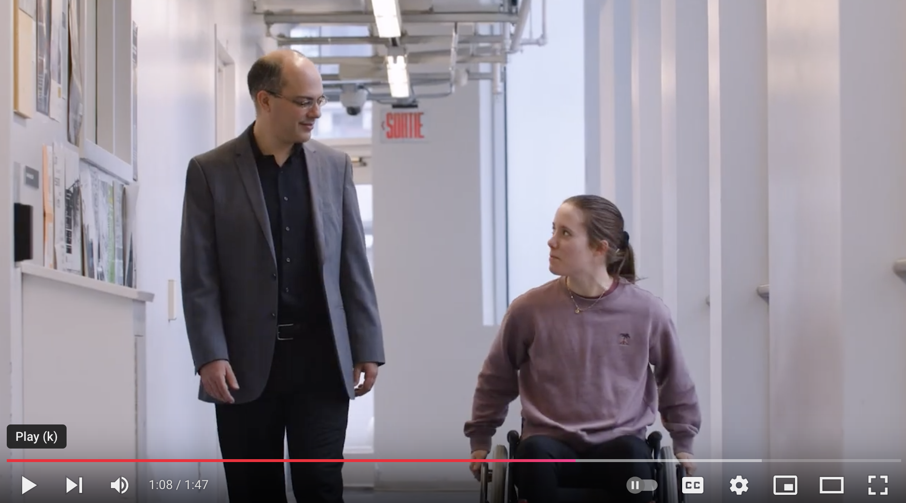

# Bienvenue

Notre mission est d’accroître les connaissances fondamentales sur les interactions biomécaniques entre la personne, son aide technique et son environnement dans un contexte de mobilité adaptée.

Ces nouvelles connaissances, acquises par le développement et l'utilisation de nouvelles technologies, sont primordiales pour mieux comprendre les mécanismes de développement des blessures et l’effet des adaptations (e.g., positionnement, dimensionnement, entraînement spécifique) sur la performance, le risque de blessures, et les bienfaits de l'activité physique adaptée dans un cadre de réadaptation fonctionnelle.

❗️ [Nous recherchons actuellement des étudiant(e)s pour plusieurs projets](/studying).

---

- [Université du Québec à Montréal (UQAM)](https://uqam.ca)
- [Centre de recherche interdisciplinaire en réadaptation du Montréal métropolitain (CRIR)](https://crir.ca)

-----------------------

## Dernières nouvelles



**Nous joindre:** [chenier.felix@uqam.ca](mailto:chenier.felix@uqam.ca)
