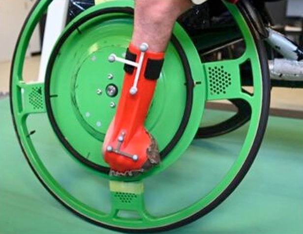

# Research

It is generally difficult for manual wheelchair (MWC) users to engage in daily physical activities; this is especially true when navigating complex environments or participating in adaptive sports, where the user must master various skills (e.g., changing direction, lifting the front wheels, etc.). Besides being challenging, these situations generate significant joint loads, leading to over 50% of users developing shoulder pain. The laboratory uses biomechanics as an approach to better understand the causes of these problems and the best ways to prevent them.

## Axis 1 - Technological Development

The biomechanics of wheelchair propulsion is a little-known field, and the necessary instruments for understanding and developing innovative interventions do not yet exist. **The first research axis** of the laboratory aims to develop the technologies needed to measure the biomechanics of wheelchair propulsion in real or simulated conditions. This translates into various technological development projects:

|                                                            |                                                                                                                                                                                                                                                                                                                                                                                                                                                                                    |
| ---------------------------------------------------------- | ---------------------------------------------------------------------------------------------------------------------------------------------------------------------------------------------------------------------------------------------------------------------------------------------------------------------------------------------------------------------------------------------------------------------------------------------------------------------------------- |
|            | **High-realism manual wheelchair propulsion simulator**, to evaluate and train wheelchair users to use effective propulsion techniques. This simulator, which combines visual and vestibular immersion, force feedback, vibrations, audio, and biofeedback, is under development at the Institut universitaire sur la réadaptation en déficience physique de Montréal and follows a user-centered approach.                                                                        |
|           | **Racing wheelchair simulator**, to evaluate and improve athlete performance. This simulator, which combines visual immersion, force feedback, and biofeedback, is under development at UQAM.                                                                                                                                                                                                                                                                                      |
|                                                            | **WheelSims**, a multicenter research project aimed at creating a unified development platform for wheelchair simulators. This open-source project is used by both simulators mentioned above. [https://github.com/wheelsims](https://github.com/wheelsims)                                                                                                                                                                                                                        |
|  | **Real-time shoulder force calculation method**, which combines motion analysis and propulsion forces during standard wheelchair propulsion on a simulator, to instantly calculate certain risk factors for shoulder injuries. This new tool will soon be combined with the simulators above to quickly visualize the effect of a change in positioning or propulsion technique.                                                                                                   |
|               | **Creation of instrumented racing wheelchair wheels**, to measure the biomechanical propulsion patterns of athletes. These wheels are being developed at UQAM in partnership with [Parasports Québec](https://parasportsquebec.com/).                                                                                                                                                                                                                                              |
|                  | **NextWheel**, an open-source project to update the instrumented SmartWheel whose manufacturer closed in 2014. This project aims to design a replacement circuit, embedded software, and a communication module distributed as open code, which improves the capabilities of the current wheels (e.g., over 1000 measurements per second instead of 240, more reliable WiFi communication). [https://github.com/felixchenier/nextwheel](https://github.com/felixchenier/nextwheel) |

## Axis 2 - Biomechanical Analysis

**The second research axis** of the laboratory aims to use these tools to better understand the biomechanical impacts of wheelchair mobility and sports on the musculoskeletal system. A better understanding of these impacts will help therapists optimize the positioning and training of MWC users and help coaches implement training programs that minimize the risk of developing various musculoskeletal disorders. Among the projects in this axis are:

|                                              |                                                                                                                                                                                                                                                                                                                                                                                                                                            |
| -------------------------------------------- | ------------------------------------------------------------------------------------------------------------------------------------------------------------------------------------------------------------------------------------------------------------------------------------------------------------------------------------------------------------------------------------------------------------------------------------------ |
|  | **Characterization of asymmetry on lateral slopes**: One of the mobility challenges for manual wheelchair users is propulsion on sidewalks, because their lateral inclination drives the wheelchair towards the street. We characterized the effect of lateral inclination on propulsion force asymmetry and proposed an index to measure this asymmetry.                                                                                  |
|   | **Biomechanical analysis of wheelchair basketball**: Wheelchair basketball is the most popular wheelchair sport. However, its benefits are overshadowed by a high rate of shoulder injuries. This project aimed to better understand the biomechanical constraints related to mobility and ball handling in this sport.                                                                                                                    |
|       | **Biomechanical analysis of wheelchair tennis starts**: As with most small-court sports, wheelchair tennis requires great acceleration to optimize wheelchair positioning with each exchange. This project aimed to understand the determinants of acceleration based on wheelchair trajectory and initial speed.                                                                                                                          |
|                                              | **Biomechanical and ergonomic analysis of forward and backward propulsions in wheelchair badminton**: Wheelchair badminton is a recent sport whose biomechanics have rarely been studied. This sport is characterized by predominant forward-backward movement interspersed with stops. This project aims to analyze this sport to better adapt the wheelchair and its accessories to increase athlete performance and reduce injury risk. |
|   | **Development of racing gloves for wheelchair racing**: This project aimed to use technologies developed by the laboratory to customize propulsion gloves for a para-athlete with atypical impairment. This allowed the development of a rigid glove with optimized wrist extension angle, that he can now put on himself.                                                                                                                 |

### Axis 3 - Promotion of Biomechanical Analysis

 **The third research axis** of the laboratory aims to promote and democratize biomechanics. Biomechanics is a multidisciplinary field often considered difficult by students, limiting the number of future researchers choosing this field. This is particularly evident in wheelchair biomechanics. To empower students and researchers who do not have training in programming and biomechanics, my laboratory created the Kinetics Toolkit project:

(1)   an open-source Python package that facilitates and automates the processing of biomechanical data (e.g., time series, events, temporal and frequency filtering, resampling, cycles, management of acquisition files, 3D geometric operations, interactive visualization, kinematic reconstruction).

(2)   an electronic book that teaches biomechanical data processing to new users, starting with basic Python programming up to complex 3D operations.

[https://kineticstoolkit.uqam.ca](https://kineticstoolkit.uqam.ca)

It is now used in graduate courses worldwide and is continuously gaining popularity, with over 1000 user-days of use per month, and over 50,000 website visits per month: [https://kineticstoolkit.uqam.ca/usagestats.html](https://kineticstoolkit.uqam.ca/usagestats.html)