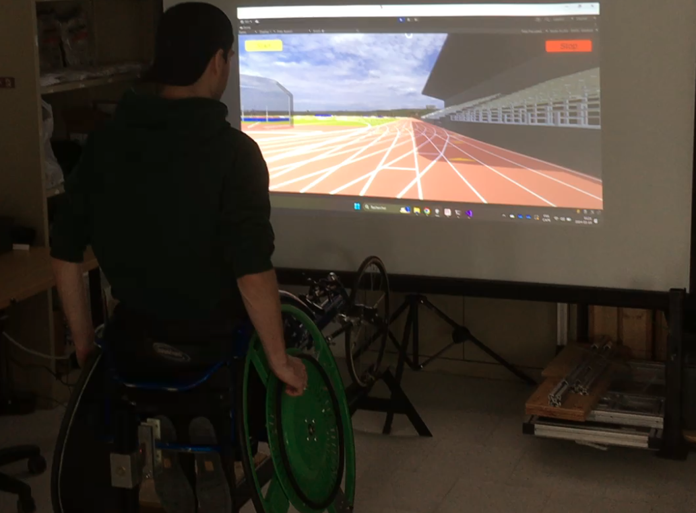
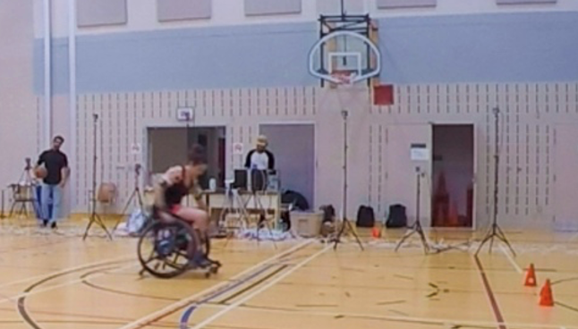

# Recherche

Il est généralement difficile pour les utilisateurs de fauteuil roulant manuel (FRM) de s'engager dans des activités physiques quotidiennes; ceci est particulièrement vrai lors de la navigation dans des environnements complexes ou lors de la pratique de sports adaptés, où l'utilisateur doit maîtriser diverses habiletés (e.g., changer de direction, lever les roues avant, etc.). En plus d'être difficiles, ces situations génèrent de grandes charges articulaires, si bien que plus de 50% des utilisateurs développent des douleurs aux épaules. Le laboratoire utilise la biomécanique comme angle d'approche pour mieux comprendre les causes de ces problèmes et les meilleures façon pour les prévenir.

## Axe 1 - Développement technologique

La biomécanique de la propulsion en fauteuil roulant est un domaine méconnu, et les instruments nécessaires à sa compréhension et au développement d'interventions novatrices n'existent pas encore. **Le premier axe de recherche** du laboratoire vise à développer les technologies nécessaires pour mesurer la biomécanique de la propulsion en fauteuil roulant en conditions réelles ou simulées. Ceci se traduit par ces différents projets de développement technologique:

|                                                            |                                                                                                                                                                                                                                                                                                                                                                                                                                                                                                     |
| ---------------------------------------------------------- | --------------------------------------------------------------------------------------------------------------------------------------------------------------------------------------------------------------------------------------------------------------------------------------------------------------------------------------------------------------------------------------------------------------------------------------------------------------------------------------------------- |
|            | **Simulateur de propulsion en fauteuil roulant manuel à haut réalisme**, pour évaluer et entraîner les usagers de fauteuil roulant à utiliser une technique de propulsion efficace. Ce simulateur, qui joint l’immersion visuelle et vestibulaire, le retour de force, les vibrations, l’audio et le biofeedback, est en cours de développement à l’Institut universitaire sur la réadaptation en déficience physique de Montréal et suit une approche centrée sur l’utilisateur.                   |
|           | **Simulateur de fauteuil de course**, pour évaluer et améliorer la performance chez les athlètes. Ce simulateur qui joint l’immersion visuelle, le retour de force et le biofeedback, est en cours de développement à l’UQAM.                                                                                                                                                                                                                                                                       |
|                                                            | **WheelSims**, un projet de recherche multicentrique visant à créer une plateforme unifiée de développement pour les simulateurs de fauteuil roulant. Ce projet open-source est utilisé par les deux simulateurs précédents. [https://github.com/wheelsims](https://github.com/wheelsims)                                                                                                                                                                                                           |
|  | **Méthode de calcul des forces aux épaules en temps réel**, qui combine l’analyse du mouvement et des forces de propulsion lors de la propulsion d’un fauteuil standard sur simulateur, de façon à calculer instantanément certains facteurs de risque de blessure aux épaules. Ce nouvel outil sera bientôt combiné aux simulateurs ci-haut pour visualiser rapidement l’effet d’un changement de positionnement ou de technique de propulsion.                                                    |
|               | **Création de roues instrumentées de fauteuil de course**, pour mesurer le patron biomécanique de propulsion des athlètes. Ces roues sont développées à l’UQAM en partenariat avec [Parasports Québec](https://parasportsquebec.com/).                                                                                                                                                                                                                                                              |
|                  | **NextWheel**, un project open-source pour mettre à jour les roues instrumentées SmartWheel dont le fabricant a fermé en 2014. Ce projet vise à concevoir un circuit de remplacement, un logiciel embarqué et un module de communication distribués en code ouvert, qui multiplie les capacités des roues actuelles (e.g., plus de 1000 mesures par seconde au lieu de 240, communication WiFi plus fiable). [https://github.com/felixchenier/nextwheel](https://github.com/felixchenier/nextwheel) |

## Axe 2 - Analyse biomécanique

**Le deuxième axe de recherche** du laboratoire vise à utiliser ces outils pour mieux comprendre les impacts biomécaniques de la mobilité et du sport en fauteuil roulant sur le système musculosquelettique. Une meilleure compréhension de ces impacts aidera les les thérapeutes à optimiser le positionnement et l’entraînement des personnes utilisatrices de FRM, et aidera les entraîneurs à mettre en place des entraînements limitant le risque de développer divers troubles musculosquelettiques. Parmi les projets de cet axe, on note :

|                                              |                                                                                                                                                                                                                                                                                                                                                                                                                                                                                |
| -------------------------------------------- | ------------------------------------------------------------------------------------------------------------------------------------------------------------------------------------------------------------------------------------------------------------------------------------------------------------------------------------------------------------------------------------------------------------------------------------------------------------------------------ |
|  | **Caractérisation de l’asymétrie sur dévers latéral**: Un des défis de mobilité chez les utilisateurs de fauteuil roulant manuel est la propulsion sur les trottoirs, dont l’inclinaison amène le fauteuil vers la rue. Nous avons caractérisé l’effet de l’inclinaison latérale sur l’asymétrie des forces de propulsion, et proposé un indice pour mesurer cette asymétrie.                                                                                                  |
|   | **Analyse biomécanique du basketball en fauteuil roulant**: Le basketball en fauteuil roulant est le sport de fauteuil le plus populaire. Or, ses effets bénéfiques sont assombris par un haut taux de blessures aux épaules. Ce projet visait à mieux comprendre les contraintes biomécaniques liées à la mobilité et au maniement du ballon dans ce sport.                                                                                                                   |
|       | **Analyse biomécanique du départ au tennis en fauteuil roulant**: Comme pour la plupart des sports de petit terrain, le tennis en fauteuil roulant requiert une grande accélération pour optimiser le positionnement du fauteuil à chaque échange. Ce projet visait à comprendre les déterminants de l’accélération en fonction de la trajectoire du fauteuil et de sa vitesse initiale.                                                                                       |
|                                              | **Analyse biomécanique et ergonomique des propulsions avant et arrière au badminton en fauteuil roulant**: Le badminton en fauteuil roulant est un sport récent dont la biomécanique a rarement été étudiée. Ce sport se caractérise par un mouvement prédominant avant-arrière entrecoupé d’arrêts. Ce projet vise à analyser ce sport de façon à mieux adapter le fauteuil et ses accessoires pour augmenter la performance de l’athlète et diminuer son risque de blessure. |
|   | **Développement de gants de course en fauteuil roulant**: Ce projet visait à utiliser les technologies développée par le laboratoire pour personnaliser les gants de propulsion d’un athlète de para-athlétisme ayant une déficience atypique. Ceci a permis de développer un gant rigide qu’il peut maintenant enfiler seul, et d’optimiser l’angle d’extension du poignet.                                                                                                   |

### Axe 3 - Promotion de l'analyse biomécanique

 **Le troisième axe de recherche** du laboratoire vise à promouvoir et démocratiser la biomécanique. La biomécanique est un domaine multidisciplinaire souvent considéré comme difficile par les étudiants, ce qui limite le nombre de futurs chercheurs choisissant ce domaine. Ceci est particulièrement évident en biomécanique du fauteuil roulant. Afin d’autonomiser les étudiants et les chercheurs qui n’ont pas de formation en programmation et en biomécanique, mon laboratoire a créé le projet Kinetics Toolkit :

(1)   un package Python open-source qui facilite et automatise le traitement de données biomécaniques (e.g., traitement des séries temporelles, événements, filtrage temporel et fréquentiel, rééchantillonnage, cycles, gestion de fichiers d’acquisitions, opérations géométriques 3D, visualisation interactive, reconstruction cinématique).

(2)   un livre électronique qui enseigne le traitement des données biomécaniques aux nouveaux utilisateurs, en débutant par la programmation Python de base jusqu'aux opérations 3D complexes.

[https://kineticstoolkit.uqam.ca](https://kineticstoolkit.uqam.ca)

Il est maintenant utilisé dans des cours de deuxième cycle dans le monde entier et gagne constamment en popularité, avec plus de 1000 usagers*jours d’utilisation par mois, et plus de 50 000 consultations du site web par mois : [https://kineticstoolkit.uqam.ca/usagestats.html](https://kineticstoolkit.uqam.ca/usagestats.html)
