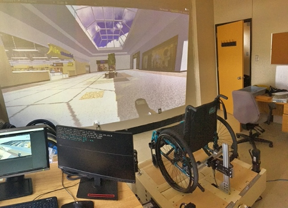
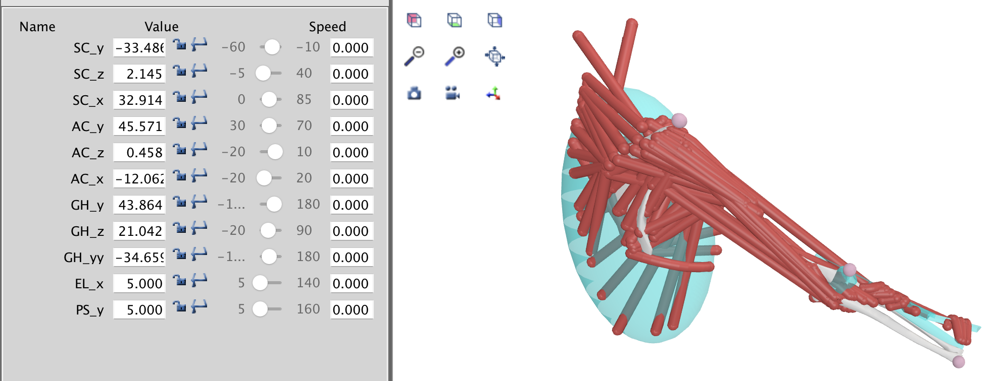
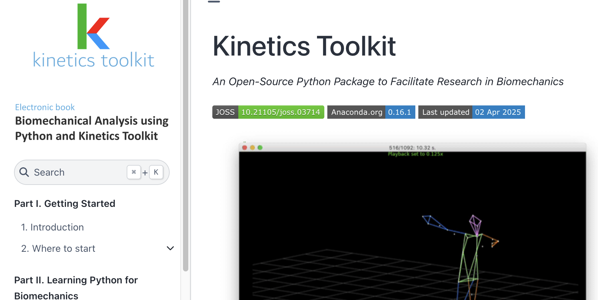

# Project Opportunities

As of April 2025, we are currently looking for several graduate students to work on the following projects. **All of these projects are funded** and can start as soon as possible:

---

## Clinical Interface for Wheelchair Simulator

**Funded project starting as soon as possible.**

**Level:** Master’s.

**Desired profile:** Bachelor’s or Master’s degree in Software Engineering or equivalent.

**Summary:** This project aims to enhance the visual immersion of a manual wheelchair propulsion simulator and to develop the simulator's interface so that it can be used by clinicians during training sessions with patients. Specifically:

1. Improve visual immersion using an additional projector (wall, floor) to better represent obstacles.
2. Co-develop a user interface with clinicians to operate the simulator.
3. Validate the simulator’s clinical use with clinicians and their patients.

**Supervision:**

- David Labbé, P.Eng., Professor, Department of Software and IT Engineering, École de technologie supérieure (ÉTS)
- Félix Chénier, Professor, Department of Physical Activity Science, Université du Québec à Montréal (UQAM)
 

**The candidate must demonstrate:**

- Knowledge of the Unity environment
- Strong autonomy, especially in programming and debugging
- High motivation
- Strong academic record
- Good communication skills, both oral and written

Please send your CV, transcripts, and a cover letter by email to [david.labbe@etsmtl.ca](mailto:david.labbe@etsmtl.ca)

---

## Musculoskeletal Study of Manual Wheelchair Propulsion

**Funded project starting as soon as possible.**

**Level:** PhD.

**Desired profile:** Master’s in Biomechanics or Biomedical/Mechanical Engineering or equivalent.

**Summary:** This project aims to develop a method for real-time calculation of joint loads during simulator-based wheelchair propulsion, using instrumented wheels and a 3D motion capture system. Ultimately, this will allow for real-time user feedback to identify optimal propulsion techniques or wheelchair adjustments to reduce the risk of upper limb pain. The project involves:

1. Creating a real-time biomechanical analysis method for manual wheelchair propulsion using musculoskeletal modelling (e.g., OpenSim).
2. Assessing the method’s reliability by comparing model-predicted muscle activity with that measured via electromyography (EMG).

**Supervision:**

- Félix Chénier, Professor, Department of physical activity science, Université du Québec à Montréal (UQAM)

**The candidate must demonstrate:**

- Experience collecting kinematic, kinetic, and/or EMG data in a lab setting
- Programming experience, ideally in Python
- Strong autonomy, especially in programming and debugging
- High motivation
- Strong academic record
- Good communication skills, both oral and written

Please send your CV, transcripts, and a cover letter by email to [chenier.felix@uqam.ca](mailto:chenier.felix@uqam.ca)

---

## Musculoskeletal Analyses with Kinetics Toolkit

**Project with funding starting as soon as possible.**

**Level:** Master’s.

**Preferred Background:** Bachelor’s degree in Computer Engineering, Biomedical Engineering, or a related field.

**Summary:** This project aims to develop an intuitive programming interface to launch musculoskeletal simulations using the open-source Kinetics Toolkit library, integrating existing open-source software such as OpenSim. The interface will be documented through an online training module using open models and datasets. The goal is to facilitate access to musculoskeletal modelling for students and researchers in biomechanics.

**Supervisor:**

- Félix Chénier, Professor, Department of physical activity science, Université du Québec à Montréal (UQAM)

**The candidate must demonstrate:**

- Experience with Python programming
- Strong autonomy, especially in programming and debugging
- Experience with laboratory-based data collection (kinematic, kinetic and/or electromyographic), or in the use of musculoskeletal models
- High motivation
- A strong academic record
- Solid oral and written communication skills

Please send your CV, transcripts, and a cover letter by email to [chenier.felix@uqam.ca](mailto:chenier.felix@uqam.ca).

---

## Dynamic Modelling for Wheelchair Simulator

**Funded project starting as soon as possible.**

**Level:** Master’s or PhD.

**Desired profile:** Bachelor’s or Master’s degree in Engineering.

**Summary:** This project aims to replicate, within a simulator, the dynamics of wheelchair propulsion in complex outdoor environments. Specifically, the student will:

1. Model the dynamics of a manual wheelchair on outdoor sidewalks with varying inclines, on gravel and concrete, and during transitions from curb to street.
2. Characterize this model using XSens motion capture, instrumented wheel force measurements, video cameras, and recorded sound samples.
3. Test these conditions in the simulator using motorized rollers (haptic feedback), virtual reality (visual immersion), a D-BOX robotic platform (tilt, vibration, impact), and speakers.

**Supervision:**

- Rachid Aissaoui, P.Eng., Professor, Department of Systems Engineering, École de technologie supérieure (ÉTS)
- Félix Chénier, Professor, Department of physical activity science, Université du Québec à Montréal (UQAM)

**The candidate must demonstrate:**

- Prior education relevant to the project
- Experience with Simulink and/or Unity
- Strong autonomy, especially in programming and debugging
- High motivation
- Strong academic record
- Good communication skills, both oral and written

Please send your CV, transcripts, and a cover letter by email to [chenier.felix@uqam.ca](mailto:chenier.felix@uqam.ca)

---

## Other Projects

I regularly recruit students interested in the following topics and fields:

- Biomechanics
- Computer programming
- Electromechanics
- Systems modelling
- Musculoskeletal modelling
- Simulators
- Adaptive sports
- Mobility

If you're interested in the lab’s research agenda and see yourself in these areas, please send your CV and a cover letter to [chenier.felix@uqam.ca](mailto:chenier.felix@uqam.ca).

