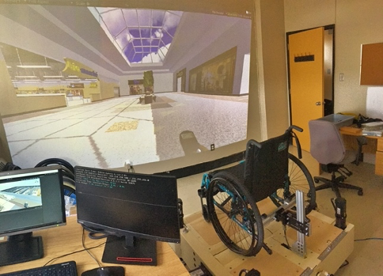
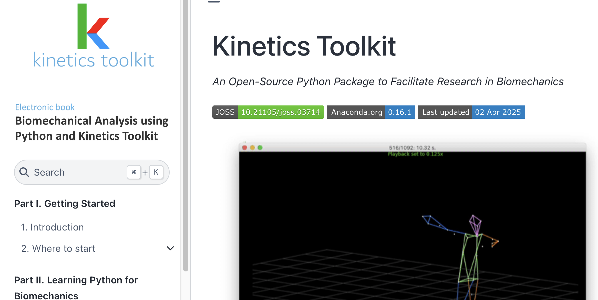

# Offres de projets

Nous sommes actuellement (en date d'avril 2025) à la recherche de plusieurs étudiant(e)s aux cycles supérieurs pour travailler sur les projets suivants. **Ce sont tous des projets avec financement**, débutant dès que possible :

---

## Interface clinique pour simulateur de fauteuil roulant

**Projet avec financement débutant dès que possible.**

**Niveau:** Maîtrise.

**Profil recherché:** Baccalauréat ou maîtrise en génie logiciel ou équivalent.

**Résumé:** Ce projet vise à bonifier l’immersion visuelle d'un simulateur de propulsion en fauteuil roulant manuel, et à développer l’aspect d’interface de ce simulateur afin qu’il puisse être utilisé par des cliniciens dans le cadre d’entraînements avec leurs patients. Plus précisément :

1. Augmenter l’immersion visuelle avec un projecteur supplémentaire (mur, plancher) afin d’améliorer la représentation des obstacles.
2. Développer, conjointement avec des cliniciens, une interface utilisateur permettant d’opérer le simulateur.
3. Valider l’usage du simulateur en clinique avec des cliniciens et leurs patients,

**Direction:**

- David Labbé, ing., Professeur, Département de génie logiciel et des TI, École de technologie supérieure (ÉTS)
- Félix Chénier, Professeur, Département des sciences de l'activité physique, Université du Québec à Montréal (UQAM)

**Le/la candidat(e) doit démontrer :**

- Une connaissance de l'environnement Unity
- Une grande autonomie, particulièrement en lien avec la programmation et le débogage
- Une excellente motivation
- Un bon dossier académique
- Une bonne capacité à communiquer oralement et par écrit

SVP envoyer votre CV, vos relevés de notes ainsi qu’une lettre de motivation par courriel à [david.labbe@etsmtl.ca](mailto:david.labbe@etsmtl.ca)

---

## Roues instrumentées de fauteuil roulant

**Projet avec financement débutant dès que possible.**

**Niveau:** Maîtrise.

**Profil recherché:** Baccalauréat en génie mécanique, électrique ou équivalent.

**Résumé:** Ce projet vise à concevoir une roue instrumentée pour fauteuil roulant qui mesure les 6 composantes de force et de moments appliquée par l'usager sur la main courante, ainsi que la vitesse du fauteuil et l'orientation de la roue. Nous avons déjà développé de premiers prototypes qui doivent toutefois être amélioré. Ce projet consistera à:

1. Concevoir des roues plus légères mais rigides à l'aide de modélisation par éléments finis.
2. Réaliser, calibrer et valider un prototype.
3. Documenter et partager ce prototype en open-source via le projet [NextWheel](https://github.com/felixchenier/nextwheel).

**Direction:**

- Félix Chénier, Professeur, Département des sciences de l'activité physique, Université du Québec à Montréal (UQAM)
- Eric Wagnac, ing., Professeur, Département de génie mécanique, École de technologie supérieure (ÉTS)

**Le/la candidat(e) doit démontrer :**

- Des aptitudes en modélisation par éléments finis
- Une grande autonomie
- Une excellente motivation
- Un bon dossier académique
- Une bonne capacité à communiquer oralement et par écrit

SVP envoyer votre CV, vos relevés de notes ainsi qu’une lettre de motivation par courriel à [chenier.felix@uqam.ca](mailto:chenier.felix@uqam.ca).

---

## Étude musculosquelettique de la propulsion en fauteuil roulant manuel

**Projet avec financement débutant dès que possible.**

**Niveau:** Doctorat.

**Profil recherché:** Maîtrise en biomécanique ou en génie biomédical, mécanique ou équivalent.

**Résumé:** Ce projet vise à concevoir une méthode pour calculer en temps réel les contraintes articulaires lors de la propulsion sur simulateur à l'aide de roues instrumentées et d'un système de capture du mouvement en 3D. À terme, ceci permettra de générer de la rétroaction à l'usager de façon à trouver une technique de propulsion optimale ou des ajustements aux fauteuil optimaux qui réduira les risques de développer de la douleur aux membres supérieurs. Ce projet consiste à:

1. Créer une méthode d'analyse biomécanique de la propulsion en fauteuil roulant manuel en temps réel par modélisation musculo-squelettique (e.g, OpenSim);
2. Mesurer la fiabilité de cette méthode en comparant l'activité musculaire prédite par la modélisation et celle mesurée par électromyographie (EMG).

**Direction:**

- Félix Chénier, Professeur, Département des sciences de l'activité physique, Université du Québec à Montréal (UQAM)

**Le/la candidat(e) doit démontrer :**

- Une expérience de mesure de données cinématiques, cinétiques et/ou électromyographiques en laboratoire
- Une expérience de programmation, idéalement sous Python
- Une grande autonomie, particulièrement en lien avec la programmation et le débogage
- Une excellente motivation
- Un bon dossier académique
- Une bonne capacité à communiquer oralement et par écrit

SVP envoyer votre CV, vos relevés de notes ainsi qu’une lettre de motivation par courriel à [chenier.felix@uqam.ca](mailto:chenier.felix@uqam.ca).

---

## Analyses musculosquelettiques avec Kinetics Toolkit

**Projet avec financement débutant dès que possible.**

**Niveau:** Maîtrise.

**Profil recherché:** Baccalauréat en génie informatique, biomédical ou équivalent.

**Résumé:** Ce projet vise à programmer une interface de programmation intuitive permettant de lancer des simulations musculosquelettiques via la librairie open-source Kinetics Toolkit, en utilisant des logiciels ouverts déjà existants tels que OpenSim. Cette interface sera documentée sous la forme d'une formation en ligne utilisant des modèles et données ouvertes. Ce projet s'inscrit dans une volonté de faciliter l'accès à la modélisation musculosquelettique chez les étudiants et chercheurs en biomécanique.

**Direction:**

- Félix Chénier, Professeur, Département des sciences de l'activité physique, Université du Québec à Montréal (UQAM)

**Le/la candidat(e) doit démontrer :**

- Une expérience de programmation sous Python
- Une grande autonomie, particulièrement en lien avec la programmation et le débogage
- Expérience de mesure de données cinématiques, cinétiques et/ou électromyographiques en laboratoire, ou d'utilisation de modèles musculosquelettiques
- Une excellente motivation
- Un bon dossier académique
- Une bonne capacité à communiquer oralement et par écrit

SVP envoyer votre CV, vos relevés de notes ainsi qu’une lettre de motivation par courriel à [chenier.felix@uqam.ca](mailto:chenier.felix@uqam.ca).

---

## Modélisation dynamique pour simulateur de fauteuil roulant

**Projet avec financement débutant dès que possible.**

**Niveau:** Maîtrise ou doctorat.

**Profil recherché:** Baccalauréat ou maîtrise en ingénierie.

**Résumé:** Ce projet vise à reproduire sur simulateur la dynamique du fauteuil roulant propulsé dans des environnements extérieurs complexes. Plus précisément, l’étudiant(e) devra :

1. Modéliser la dynamique d’un fauteuil roulant manuel propulsé sur trottoir extérieur à différentes inclinaisons, sur gravelle et lors des transitions entre le trottoir et la rue.
2. Caractériser ce modèle à l’aide d’un système de capture du mouvement XSens, de capture des forces par des roues instrumentées et de caméras vidéo, et enregistrer des échantillons sonores.
3. Tester ces conditions sur simulateur à l’aide de rouleaux motorisés (rétroaction haptique), de réalité virtuelle (immersion visuelle), d’une plateforme robotique D-BOX (inclinaison, vibration et chocs), et d’enceintes acoustiques.

**Direction:**

- Rachid Aissaoui, ing. Professeur, Département de génie des systèmes, École de technologie supérieure (ÉTS)
- Félix Chénier, Professeur, Département des sciences de l'activité physique, Université du Québec à Montréal (UQAM)

**Le/la candidat(e) doit démontrer :**

- Une formation antérieure liée au projet
- De l’expérience avec Simulink et/ou Unity
- Une grande autonomie, particulièrement en lien avec la programmation et le débogage
- Une excellente motivation
- Un bon dossier académique
- Une bonne capacité à communiquer oralement et par écrit

SVP envoyer votre CV, vos relevés de notes ainsi qu’une lettre de motivation par courriel à [chenier.felix@uqam.ca](mailto:chenier.felix@uqam.ca)

---

## Autres projets

Je recrute régulièrement des étudiant(e)s intéressé(e)s par ces sujets et domaines :

- Biomécanique
- Programmation informatique
- Électromécanique
- Modélisation de systèmes
- Modélisation musculosquelettique
- Simulateurs
- Sports adaptés
- Mobilité

Si la programmation de recherche du laboratoire vous intéresse et que vous vous reconnaissez dans ces sujets et domaines, SVP envoyez votre CV et une lettre de motivation à [chenier.felix@uqam.ca](mailto:chenier.felix@uqam.ca).

