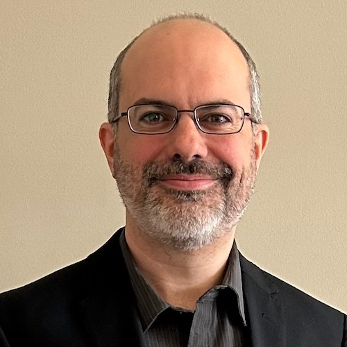

# Team

## Director

|                                              |                                                                                                                                                                                                                                                                                                                                                                                                                                                                                                                                                    |
| -------------------------------------------- | -------------------------------------------------------------------------------------------------------------------------------------------------------------------------------------------------------------------------------------------------------------------------------------------------------------------------------------------------------------------------------------------------------------------------------------------------------------------------------------------------------------------------------------------------- |
|  | **Félix Chénier** is an Associate Professor at the Université du Québec à Montréal (UQAM), an Associate Professor at the École de technologie supérieure (ÉTS), and a researcher at the Centre de recherche interdisciplinaire en réadaptation du Montréal métropolitain (CRIR). His research focuses on the development of new technologies and the biomechanical study of manual wheelchair propulsion to promote an active lifestyle while preventing the development of musculoskeletal disorders. [Affiliations and Education](affiliations). |

## Doctoral Students

|                                                 |                                                                                                                                                                                                                                                                                                                                                                                                      |
| :---------------------------------------------- | ---------------------------------------------------------------------------------------------------------------------------------------------------------------------------------------------------------------------------------------------------------------------------------------------------------------------------------------------------------------------------------------------------- |
|      | **Ateayeh Bayat** is a PhD candidate in engineering at the École de technologie supérieure. Her research project involves designing and validating a highly realistic manual wheelchair propulsion simulator at the Centre de recherche interdisciplinaire en réadaptation du Montréal métropolitain, which will then be used to create simulator training programs for new manual wheelchair users. |
|  | **Salman Nourbakhsh** is a PhD candidate in rehabilitation sciences at McGill University under the supervision of Philippe Archambault and is doing a doctoral internship in the laboratory. He is creating a 3D game-style virtual environment to analyze and improve manual wheelchair propulsion techniques.                                                                                      |

## Master's Students

|                                                        |                                                                                                                                                                                                                                                                                                                            |
| :----------------------------------------------------- | -------------------------------------------------------------------------------------------------------------------------------------------------------------------------------------------------------------------------------------------------------------------------------------------------------------------------- |
|  | **Nicolas Fleury-Rousseau** is a master's candidate in physical activity sciences at UQAM. His research project involves developing and validating an algorithm for measuring/estimating the orientation and speed of an instrumented wheel using an inertial unit.                                                        |
|              | **Jules Lavoie** is a master's candidate in neuroscience at McGill University, under the supervision of Philippe Archambault and Félix Chénier. His research project aims to optimize and automate biofeedback and the automatic evaluation of propulsion technique for manual wheelchair users during simulator training. |

## Interns

|                                                 |                                                                                                                                                                                                                                                                                                                                                                                                                                          |
| :---------------------------------------------- | ---------------------------------------------------------------------------------------------------------------------------------------------------------------------------------------------------------------------------------------------------------------------------------------------------------------------------------------------------------------------------------------------------------------------------------------- |
|        | **Simon Manès** is a master's student in the digital generalist engineering program at Télécom Sud Paris (Evry, France). His project aims to design digital elements such as games, sound designs, behaviours, etc., for a manual wheelchair propulsion simulator, so that users can engage in progressive and stimulating training in rich environments.                                                                                |

## Research Staff

|                                            |                                                                                                                                                                                                                                      |
| ------------------------------------------ | ------------------------------------------------------------------------------------------------------------------------------------------------------------------------------------------------------------------------------------ |
|  | **Antoine Parrinello** is an engineer and electronics technician in the Department of Physical Activity Sciences at UQAM. He is responsible for the design and implementation of the laboratory's electronic systems. |

## PhD Graduates

|                                              |                                                                                                                                                                                                                                                                                                                                                                                                                                                                                                               |
| :------------------------------------------- | ------------------------------------------------------------------------------------------------------------------------------------------------------------------------------------------------------------------------------------------------------------------------------------------------------------------------------------------------------------------------------------------------------------------------------------------------------------------------------------------------------------- |
|  | **Ilona Alberca** completed her PhD thesis in Sports and Physical Activity Sciences and Techniques (STAPS) at the University of Toulon (France), co-supervised by Arnaud Faupin and Félix Chénier. Her thesis is titled "Analyse biomécanique des spécificités du badminton fauteuil", which translates to "Biomechanical analysis of the specificities of wheelchair badminton". She previously completed her Master 1 in Toulon on wheelchair tennis and her Master 2 in Montreal on wheelchair basketball. |

## Master's Graduates

|                                                      |                                                                                                                                                                                                                                                                                                                                                                                                                                                                                                                                                                                              |
| ---------------------------------------------------- | -------------------------------------------------------------------------------------------------------------------------------------------------------------------------------------------------------------------------------------------------------------------------------------------------------------------------------------------------------------------------------------------------------------------------------------------------------------------------------------------------------------------------------------------------------------------------------------------- |
|         | **Gabriel Després** completed his master's in physical activity sciences at UQAM. He designed and tested a biofeedback system for para-athletes using virtual reality to improve their performance in wheelchair racing.                                                                                                                                                                                                                                                                                                                                                                     |
|  | **Maude Fleury-Rousseau** completed her master's in physical activity sciences at UQAM. Her research project involved establishing and standardizing a biomechanical assessment protocol for manual or sports wheelchair propulsion in the laboratory.                                                                                                                                                                                                                                                                                                                                       |
|      | **Clément Ghazouani** completed his master's in engineering, jointly supervised at the École de technologie supérieure in Montreal and Polytech-Montpellier in France, under the supervision of Rachid Aissaoui and Félix Chénier. His research project involved developing real-time load calculations during simulator wheelchair propulsion to reduce the biomechanical and physiological load of propulsion using biofeedback.                                                                                                                                                           |
|         | **Rabail Khowaja** completed her master's in rehabilitation sciences at McGill University in 2021, under the supervision of Philippe Archambault and Félix Chénier. Her research project involved establishing and validating biomechanical parameters that can be measured without an instrumented wheel during low-cost wheelchair propulsion simulator use.                                                                                                                                                                                                                               |
|        | **Étienne Marquis** completed his master's in kinesiology at UQAM's Department of Physical Activity Sciences in 2021. His research project involved designing and validating a dynamic model of wheelchair propulsion that includes the effect of upper body movement on acceleration and rolling resistance. He previously participated in two research internships in the laboratory, one on the effect of an orthopedic insole on the center of pressure in the foot during ice skating, and another on developing algorithms for reconstructing the kinematics of wheelchair basketball. |
|      | **Ary Pizarro Chong** completed his master's thesis entitled "Development and Validation of the Control Loops for the Haptic Interfaces of a Standard Manual Wheelchair Simulator" in health technology engineering at ÉTS in 2020. He designed a new control loop for a wheelchair propulsion simulator so that the user's wheelchair could be used as is without having to change its wheels for instrumented ones.                                                                                                                                                                        |
|                                                      | **Hesam Eskandari** completed his master's in software and information technology engineering at ÉTS under the supervision of Carlos Vazquez and Félix Chénier. His project involved developing a circular marker tracking algorithm for 3D position calculation using a single fish-eye camera during racing wheelchair propulsion.                                                                                                                                                                                                                                                         |
|                                                      | **Jean-Luc Fauvel** completed his master's in ergonomic design at UQAM's School of Design under the supervision of Steve Vezeau and Félix Chénier. His project involved analyzing wheelchair racing from an ergonomic perspective to identify determinants to create an instrumented racing wheel.                                                                                                                                                                                                                                                                                           |

## Former Research Interns

|                                                  |                                                                                                                                                                                                                                                                                                                                                                          |
| ------------------------------------------------ | ------------------------------------------------------------------------------------------------------------------------------------------------------------------------------------------------------------------------------------------------------------------------------------------------------------------------------------------------------------------------ |
|   | **Thibaud Pradelle** is an engineering student at the École Nationale Supérieure de Cognitique (ENSC - Bordeaux INP). He completed an internship at the laboratory under the co-supervision of David Labbé (École de technologie supérieure, Montreal). He created a clinical interface and added a floor projector for a manual wheelchair propulsion simulator.        |
|     | **Islande Teillet**, then a student at the Pôle Léonard de Vinci School of Engineering (ESILV) in Paris, completed an internship in the laboratory that involved integrating and developing visualization algorithms for manual wheelchair propulsion techniques to provide biofeedback to users during simulator training.                                              |
|        | **Abir Brahmi**, then a computer science student at Université Sésame in Tunisia, completed a final study internship at the laboratory. She developed modular virtual reality environments under Unity for training wheelchair propulsion on a simulator.                                                                                                                |
|       | **Karla Brottet**, then a biomechanics student at Université Claude Bernard Lyon 1, France, completed her Master 2 internship at the laboratory. Her project involved developing an extension to the Python package Kinetics Toolkit to perform series of musculoskeletal analyses using the OpenSim software.                                                           |
|  | **Clémence Starosta**, then a microelectronics and computer engineering student at the Mines Saint-Étienne School of Engineering, Gardanne, France, completed her Master 1 internship at the laboratory. Her project involved designing a communication interface and a user interface for controlling and transmitting data from instrumented manual wheelchair wheels. |
|    | **Noëlie Vergnes**, then a biomedical engineering student at Polytech Marseille, France, completed her internship project at the laboratory, which involved characterizing the muscular demands of various mobility and ball-handling tasks in wheelchair basketball using electromyographic analyses of these actions.                                                  |
|           | **Léa Kohl**, then an engineering student at the EPF Sceaux School of Engineering in Paris, completed a research internship in Montreal, which involved developing a tilting robotic platform for a manual wheelchair propulsion simulator.                                                                                                                              |
|      | **Hervé Lasbats**, then a kinesiology student in the Department of Physical Activity Sciences at UQAM, completed an internship that involved validating a method for estimating the center of pressure based on kinematics in manual wheelchair users.                                                                                                                   |
|                                                  | **Lilia Djoussouf** completed her Master's in engineering at Sorbonne University (France), with her Master 1 internship in Montreal. Her project involved developing an inverse dynamics algorithm for calculating joint constraints during wheelchair basketball.                                                                                                       |
|                                                  | **Pierre-Olivier Bédard** implemented an experimental protocol for a biomechanical study of wheelchair basketball.                                                                                                                                                                                                                                                       |
|                                                  | **Guy El Hajj Boutros** implemented a 3D kinematic measurement experimental protocol for the biomechanical study of adapted sports.                                                                                                                                                                                                                                      |
|                                                  | **Kim Lefebvre** performed dynamic testing of a 3D position extraction method for spherical markers using a single camera during racing wheelchair propulsion.                                                                                                                                                                                                           |
|                                                  | **Charles-Antoine Russel** analyzed the spatiotemporal parameters of athletic wheelchair propulsion on a training roller.                                                                                                                                                                                                                                                |
|                                                  | **Geneviève Clermont** analyzed the spatiotemporal parameters of athletic wheelchair propulsion on a training roller.                                                                                                                                                                                                                                                    |
|                                                  | **Julien Malbequi** measured propulsion forces of an athletic wheelchair on a dynamometer and on an instrumented training roller, and validated an index for measuring the symmetry and synchronism of pushes during manual wheelchair propulsion.                                                                                                                       |
|                                                  | **Philippe Gaumond** measured upper limb muscle activity during manual wheelchair propulsion on a lateral inclined plane.                                                                                                                                                                                                                                                |
|                                                  | **Maxime Gosselin** developed an innovative method for measuring body kinematics in three dimensions using a camera with a fish-eye lens.                                                                                                                                                                                                                                |
|                                                  | **Sébastien Harvey** measured the amplitudes and bilateral patterns of upper limb muscle activity during manual wheelchair propulsion on a lateral inclined plane.                                                                                                                                                                                                       |
|                                                  | **Camille Jouval** studied the kinetics of manual wheelchair propulsion on a lateral inclined plane and compared spatiotemporal parameters and ground reaction forces on a dual-belt instrumented treadmill with handrail forces during manual wheelchair propulsion.                                                                                                    |
|                                                  | **Xavier Roy** compared and analyzed the speed measurements of PUSH Band and My Jump systems with an optoelectronic motion capture system and predicted the maximum 1RM load using the PUSH Band system.                                                                                                                                                                 |
