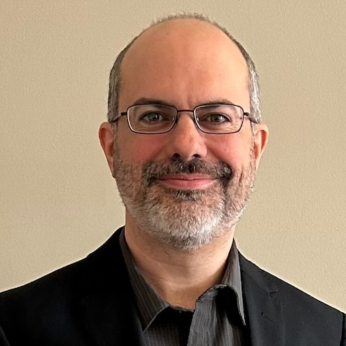
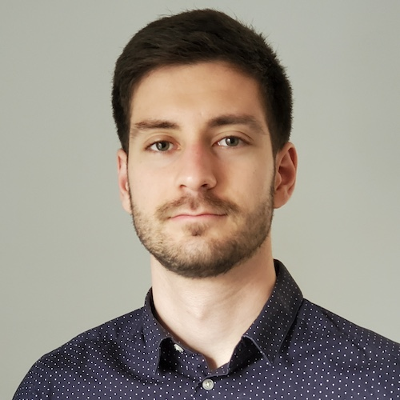
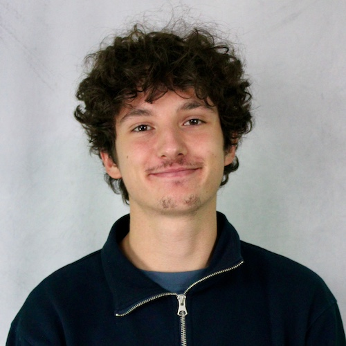
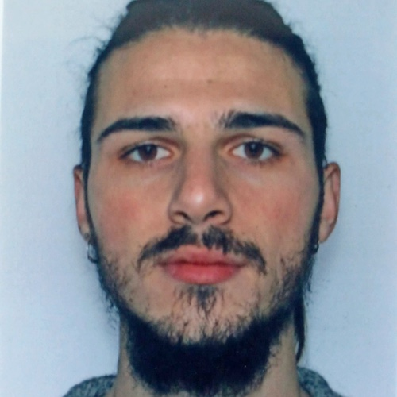
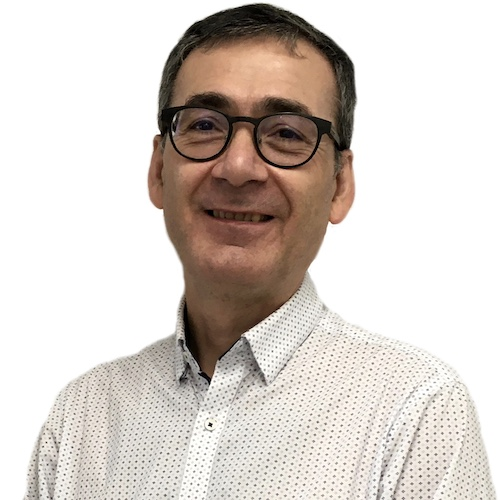
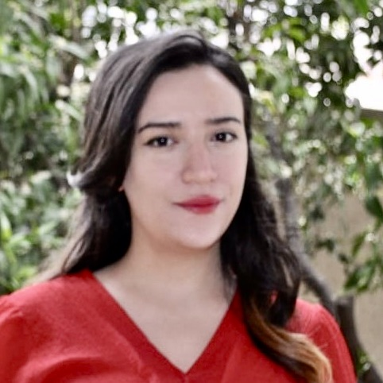
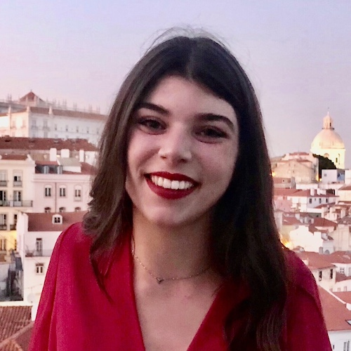
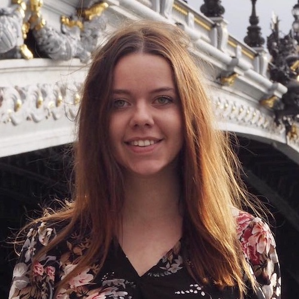

# Équipe

## Directeur

|                                              |                                                                                                                                                                                                                                                                                                                                                                                                                                                                                                                                                                                  |
| -------------------------------------------- | -------------------------------------------------------------------------------------------------------------------------------------------------------------------------------------------------------------------------------------------------------------------------------------------------------------------------------------------------------------------------------------------------------------------------------------------------------------------------------------------------------------------------------------------------------------------------------- |
|  | **Félix Chénier** est professeur agrégé à l’Université du Québec à Montréal (UQAM), professeur associé à l’École de technologie supérieure (ÉTS) et chercheur au Centre de recherche interdisciplinaire en réadaptation du Montréal métropolitain (CRIR). Ses travaux de recherche portent sur le développement de nouvelles technologies et sur l’étude biomécanique de la propulsion en fauteuil roulant manuel, dans le but de favoriser un mode de vie actif tout en prévenant le développement de troubles musculosquelettiques. [Affiliations et formation](affiliations). |

## Étudiants au doctorat

|                                                 |                                                                                                                                                                                                                                                                                                                                                                                                                                                           |
| :---------------------------------------------- | --------------------------------------------------------------------------------------------------------------------------------------------------------------------------------------------------------------------------------------------------------------------------------------------------------------------------------------------------------------------------------------------------------------------------------------------------------- |
|      | **Ateayeh Bayat** est candidate au doctorat en génie à l'École de technologie supérieure. Son projet de recherche consiste à concevoir et valider un simulateur de propulsion en fauteuil roulant manuel à haut réalisme au Centre de recherche interdisciplinaire en réadaptation du Montréal métropolitain, qui sera ensuite utilisé pour créer des programmes d’entraînement sur simulateur chez les nouveaux utilisateurs de fauteuil roulant manuel. |
|  | **Salman Nourbakhsh** est candidat au doctorat en sciences de la réadaptation à l'Université McGill sous la supervision de Philippe Archambault, et effectue un stage doctoral au laboratoire consistant à réaliser un environnement virtuel de style jeu 3D pour analyser et améliorer la technique de propulsion en fauteuil roulant manuel.                                                                                                            |

## Étudiants à la maîtrise

|                                                        |                                                                                                                                                                                                                                                                                                                                                                   |
| :----------------------------------------------------- | ----------------------------------------------------------------------------------------------------------------------------------------------------------------------------------------------------------------------------------------------------------------------------------------------------------------------------------------------------------------- |
|           | **Gabriel Després** est candidat à la maîtrise en sciences de l’activité physique à l'UQAM. Son projet de recherche consiste à concevoir et tester des modalités de biofeedback chez les para-athlètes à l'aide de réalité virtuelle, en vue d'améliorer leur performance.                                                                                        |
|  | **Nicolas Fleury-Rousseau** est candidat à la maîtrise en sciences de l'activité physique à l'UQAM. Son projet de recherche consiste à développer et valider un algorithme de mesure/estimation de l'orientation et vitesse d'une roue instrumentée à l'aide d'une unité inertielle.                                                                              |
|              | **Jules Lavoie** est candidat à la maîtrise en neurosciences à l'Université McGill, sous la direction de Philippe Archambault et Félix Chénier. Son projet de recherche vise à optimiser et automatiser le biofeedback et l'évaluation automatique de la technique de propulsion chez les usagers de fauteuil roulant manuel lors d'entraînements sur simulateur. |

## Stagiaires

|                                                 |                                                                                                                                                                                                                                                                                                                                                                                                                                                           |
| :---------------------------------------------- | --------------------------------------------------------------------------------------------------------------------------------------------------------------------------------------------------------------------------------------------------------------------------------------------------------------------------------------------------------------------------------------------------------------------------------------------------------- |
|  | **Thibaud Pradelle** est étudiant en ingénierie à l'École Nationale Supérieure de Cognitique (ENSC - Bordeaux INP). Il réalise son stage au laboratoire en cosupervision avec David Labbé (École de technologie supérieure, Montréal). Son projet vise à concevoir une interface clinique et à gérer l'affichage par projections d'un simulateur de propulsion en fauteuil roulant manuel, de façon à ce qu'il puisse être utilisé en recherche clinique. |
|        | **Simon Manès** est étudiant à la maîtrise dans le programme d'ingénieur généraliste numérique de l'École Télécom Sud Paris (Evry, France). Son projet vise à concevoir des éléments numériques tels des jeux, designs sonores, comportements, etc., pour un simulateur de propulsion en fauteuil roulant manuel, de façon à ce que les usagers puisse réaliser des entraînements progressifs et stimulants dans des environnements riches.               |

## Personnel de recherche

|                                            |                                                                                                                                                                                                                                      |
| ------------------------------------------ | ------------------------------------------------------------------------------------------------------------------------------------------------------------------------------------------------------------------------------------ |
|  | **Antoine Parrinello** est ingénieur et technicien en électronique au Département des sciences de l'activité physique de l'UQAM. Il est responsable de la conception et de la réalisation des systèmes électroniques du laboratoire. |

## Diplômés, niveau doctorat

|                                              |                                                                                                                                                                                                                                                                                                                                                                                                                                                      |
| :------------------------------------------- | ---------------------------------------------------------------------------------------------------------------------------------------------------------------------------------------------------------------------------------------------------------------------------------------------------------------------------------------------------------------------------------------------------------------------------------------------------- |
|  | **Ilona Alberca** a complété son doctorat en Sciences et techniques du sport et de l'activité physique (STAPS) à l'Université de Toulon (France), sous la codirection de Arnaud Faupin et Félix Chénier. Sa thèse est intitulée "Analyse biomécanique des spécificités du badminton fauteuil". Elle a auparavant complété son Master 1 à Toulon sur le tennis en fauteuil roulant, et son Master 2 à Montréal sur le basketball en fauteuil roulant. |

## Diplômés, niveau maîtrise

|                                               |                                                                                                                                                                                                                                                                                                                                                                                                                                                                                                                                                                                                                                                                     |
| --------------------------------------------- | ------------------------------------------------------------------------------------------------------------------------------------------------------------------------------------------------------------------------------------------------------------------------------------------------------------------------------------------------------------------------------------------------------------------------------------------------------------------------------------------------------------------------------------------------------------------------------------------------------------------------------------------------------------------- |
|  | **Maude Fleury-Rousseau** a complété sa maîtrise en sciences de l’activité physique à l'UQAM. Son projet de recherche consistait à établir et standardiser un protocole d’évaluation biomécanique de la propulsion d’un fauteuil roulant manuel ou de sport en laboratoire.                                                                                                                                                                                                                                                                                                                                                                                         |
|      | **Clément Ghazouani** a complété sa maîtrise en génie, en cotutelle à l'École de technologie supérieure de Montréal et à Polytech-Montpellier en France, sous la direction de Rachid Aissaoui et Félix Chénier. Son projet de recherche consistait à développer des calculs de charge en temps réel lors de la propulsion en fauteuil roulant sur simulateur, pour réduire la charge biomécanique et physiologique de la propulsion à l'aide de biofeedback.                                                                                                                                                                                                        |
|         | **Rabail Khowaja** a complété sa maîtrise en Sciences de la réadaptation à l'Université McGill en 2021, sous la direction de Philippe Archambault et Félix Chénier. Son projet de recherche consistait à établir et à valider les paramètres biomécaniques pouvant être mesurés sans roue instrumentée lors de la propulsion sur un simulateur de fauteuil roulant à faible coût.                                                                                                                                                                                                                                                                                   |
|        | **Étienne Marquis** a complété sa maîtrise en kinanthropologie à l'UQAM, au Département des Sciences de l'activité physique, en 2021. Son projet de recherche consistait à concevoir et valider un modèle dynamique de la propulsion en fauteuil roulant qui inclut l'effet du mouvement du haut du corps sur l'accélération et la résistance de roulement. Il a auparavant participé à deux stages de recherche au laboratoire, dont un sur l'effet d'une semelle orthopédique sur le centre de pression au pied lors du patinage sur glace, et un autre sur le développement d'algorithmes de reconstruction de la cinématique du basketball en fauteuil roulant. |
|      | **Ary Pizarro Chong** a réalisé sa maîtrise intitulée "Development and Validation of the Control Loops for the Haptic Interfaces of a Standard Manual Wheelchair Simulator" en génie des technologies de la santé à l'ÉTS, en 2020. Il a conçu une nouvelle boucle de contrôle pour un simulateur de propulsion en fauteuil roulant afin que le fauteuil de l'usager puisse être utilisé tel quel sans avoir à changer ses roues pour des roues instrumentées.                                                                                                                                                                                                      |
|                                               | **Hesam Eskandari** a réalisé sa maîtrise en génie logiciel et de technologies de l'information à l'ÉTS, sous la direction de Carlos Vazquez et Félix Chénier. Son projet consistait à développer un algorithme de suivi de marqueurs circulaires pour le calcul de position 3D à l'aide d'une seule caméra fish-eye lors de le propulsion d'un fauteuil roulant de course.                                                                                                                                                                                                                                                                                         |
|                                               | **Jean-Luc Fauvel** a réalisé sa maîtrise en design ergonomique à l'École de design de l'UQAM, sous la supervision de Steve Vezeau et Félix Chénier. Son projet consistait à analyser la course en fauteuil roulant selon une perspective ergonomique afin d'en ressortir les déterminants, dans le but de créer une roue instrumentée de course.                                                                                                                                                                                                                                                                                                                   |

## Anciens stagiaires de recherche

|                                                  |                                                                                                                                                                                                                                                                                                                                                                                            |
| ------------------------------------------------ | ------------------------------------------------------------------------------------------------------------------------------------------------------------------------------------------------------------------------------------------------------------------------------------------------------------------------------------------------------------------------------------------ |
|     | **Islande Teillet**, alors étudiante à l'École d'ingénieurs du Pôle Léonard de Vinci (ESILV) à Paris, a réalisé un stage consistant à intégrer et développer des algorithmes de visualisation de la technique de propulsion en fauteuil roulant, de façon à offrir du biofeedback aux usagers lors d'entraînements sur simulateur.                                                         |
|        | **Abir Brahmi**, alors étudiante en informatique à l'Université Sésame en Tunisie, a réalisé un stage de fin d'études au laboratoire. Elle a développé des environnements de réalité virtuelle modulaires sous Unity pour l'entraînement de la propulsion en fauteuil roulant sur simulateur.                                                                                              |
|       | **Karla Brottet** alors étudiante en biomécanique à l'Université Claude Bernard Lyon 1, France, a réalisé son projet de stage de Master 2 au laboratoire. Son projet consistait à développer une extension au package python Kinetics Toolkit pour réaliser des séries d'analyses musculosquelettiques à l'aide du logiciel OpenSim.                                                       |
|  | **Clémence Starosta** alors étudiante en génie microélectronique et informatique à l'École d'ingénieurs Mines Saint-Étienne, Gardanne, France, a réalisé son stage de Master 1 au laboratoire. Son projet consistait à concevoir une interface de communication et une interface usager pour le contrôle et la transmission des données de roues instrumentées de fauteuil roulant manuel. |
|    | **Noëlie Vergnes** alors étudiante en génie biomédical à Polytech Marseille, France, a effectué son projet de stage au laboratoire, qui consistait à caractériser les demandes musculaires de différentes tâches de mobilité et de maniement de ballon au basketball en fauteuil roulant, à l'aide d'analyses électromyographiques de ces gestes.                                          |
|           | **Léa Kohl** alors étudiante en ingénierie à l'École d'ingénieurs EPF Sceaux, à Paris, a effectué un stage de recherche à Montréal, qui consistait à développer une plateforme robotique inclinable pour un simulateur de propulsion en fauteuil roulant manuel.                                                                                                                           |
|      | **Hervé Lasbats**, alors étudiant en kinésiologie au Département des sciences de l'activité physique à l'UQAM, a effectué un stage qui consistait à valider une méthode d'estimation du centre de pression basé sur la cinématique chez les utilisateurs de fauteuil roulant manuel.                                                                                                       |
|                                                  | **Lilia Djoussouf** a réalisé son Master en ingénierie à l'Université Sorbonne (France), dont elle a effectué le stage de Master 1 à Montréal. Son projet consistait à développer un algorithme de dynamique inverse pour le calcul de contraintes articulaires lors du basketball en fauteuil roulant.                                                                                    |
|                                                  | **Pierre-Olivier Bédard** \- Mise en œuvre d'un protocole expérimental pour une étude biomécanique du basketball en fauteuil roulant.                                                                                                                                                                                                                                                      |
|                                                  | **Guy El Hajj Boutros** \- Mise en place d'un protocole expérimental de mesure cinématique 3D pour l'étude biomécanique de sports adaptés.                                                                                                                                                                                                                                                 |
|                                                  | **Kim Lefebvre** \- Test dynamique d'une méthode d'extraction de la position 3D de marqueurs sphériques à l’aide d'une seule caméra lors de la propulsion d’un fauteuil roulant de course.                                                                                                                                                                                                 |
|                                                  | **Charles-Antoine Russel** \- Analyse des paramètres spatiotemporels de la propulsion d’un fauteuil roulant d’athlétisme sur rouleau d’entraînement.                                                                                                                                                                                                                                    |
|                                                  | **Geneviève Clermont** \- Analyse des paramètres spatiotemporels de la propulsion d'un fauteuil roulant d'athlétisme sur rouleau d'entraînement.                                                                                                                                                                                                                                           |
|                                                  | **Julien Malbequi** \- Mesure des forces de propulsion d'un fauteuil roulant d'athlétisme sur dynamomètre et sur rouleau d'entraînement instrumenté, et validation d’un indice de mesure de la symétrie et du synchronisme des poussées lors de la propulsion d’un fauteuil roulant manuel.                                                                                                |
|                                                  | **Philippe Gaumond** \- Mesure de l'activité musculaire du membre supérieur lors de la propulsion d'un fauteuil roulant manuel sur un plan incliné latéral.                                                                                                                                                                                                                                |
|                                                  | **Maxime Gosselin** \- Élaboration d’une méthode novatrice pour mesurer la cinématique du corps en trois dimensions à l’aide d’une caméra ayant une lentille Fish-Eye                                                                                                                                                                                                                      |
|                                                  | **Sébastien Harvey** \- Mesure des amplitudes et des patrons bilatéraux d'activité musculaire du membre supérieur lors de la propulsion d'un fauteuil roulant manuel sur un plan incliné latéral.                                                                                                                                                                                          |
|                                                  | **Camille Jouval** \- Étude de la cinétique de la propulsion en fauteuil roulant manuel sur plan incliné latéral, et comparaison des paramètres spatio-temporaux et des forces de réaction au sol sur tapis roulant instrumenté à double courroie avec les forces aux mains courantes lors de la propulsion du fauteuil roulant manuel.                                                    |
|                                                  | **Xavier Roy** \- Comparaison et analyse des mesures de vitesse des systèmes PUSH Band et My Jump avec un système optoélectronique de capture du mouvement, et prédiction de la charge maximale 1RM à l'aide du système PUSH Band.                                                                                                                                                         |
